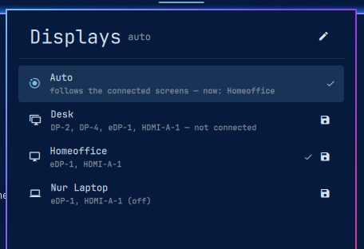

# Monitor Profiles — Omarchy bar widget

[](https://codecov.io/gh/Mario-Mohar/omarchy-monitor-profiles)

Named monitor arrangements in the bar. Place your screens however you like,
press the save button, and that setup is one click away from then on — at the
desk, at home, or with the laptop on its own.

<p align="center">
  
</p>

**Auto** is the default: it picks the most specific saved setup whose screens
are all plugged in, so docking and undocking sorts itself out without you
touching anything.

## Install

```bash
omarchy plugin add https://github.com/Mario-Mohar/omarchy-monitor-profiles --enable
~/.config/omarchy/plugins/themo.monitor-profiles/install
```

The second step is **not** optional. It adds one `dofile` line to
`~/.config/hypr/monitors.lua`, and that line is what actually moves your
screens — without it the widget switches profiles and nothing happens. It also
puts `monitor-profiles` on your PATH. Running it twice is harmless.

Then add the widget to the bar:

```bash
omarchy plugin enable themo.monitor-profiles right
```

**Requirements:** Hyprland with the Lua config (Omarchy's default) and Python 3
— the standard library alone, with no additional packages to fetch.

## Using it

Click the pill to open the list. Clicking a row pins that setup; clicking
**Auto** hands the choice back to whatever is plugged in.

| | |
|---|---|
| Click a row | Pin that setup |
| 󰆓 on a row | Save the current arrangement into that setup |
| 󰆴 on a row | Delete that setup — click it twice, the second click confirms |
| **New setup** at the bottom | Name a new setup; the screens as they are now get saved into it |
| 󰏫 in the header | Open `profiles.json` in your editor |
| Middle click the pill | Cycle Auto → setup 1 → setup 2 → … |
| Scroll the pill | Same, in either direction |
| ↑ ↓ and Enter | Move and apply, without the mouse |

Twelve setups fit; three come with the plugin. **New setup** at the bottom of
the list asks for a name, turns it into an id and saves the current
arrangement straight into it — arrange, name, done. Deleting keeps a copy of
the previous `profiles.json` under `backups/`, and if you delete the setup
that is pinned, the widget drops back to Auto.

The three setups start empty. Arrange your screens the way you want them —
with `nwg-displays`, `hyprctl keyword monitor …`, or by hand in
`monitors.lua` — then press 󰆓 on the row you want to hold it. That records
resolution, refresh rate, position, scale, rotation and mirroring for every
output, plus which screens have to be connected for Auto to choose it.

## How Auto chooses

Every setup remembers the outputs it was captured with. Auto takes the setup
with the **most** required outputs that are all currently connected, so a
four-screen desk wins over a two-screen home setup, which wins over the laptop
on its own — regardless of the order they are saved in. A setup with no
required outputs matches everything and is the last resort.

Outputs a setup switches *off* are not counted as required. A laptop-only setup
that disables the external monitor does not start demanding that monitor.

Connected screens are read from `/sys/class/drm`, not from the compositor: the
lookup runs while Hyprland is parsing its own config, and asking the compositor
a question from inside its config parse deadlocks instead of answering.

## Docking and undocking

Plugging a screen in changes which setup Auto should pick, but nothing re-reads
the Hyprland config on its own. The loader installed by `install` subscribes to
Hyprland's `monitor.added` and `monitor.removed` events and reloads — but only
when the answer actually changed, so plugging in a screen no profile cares
about moves no windows.

A dock brings several outputs up at once and fires one event each. Those are
serialised behind a lock and given a moment to settle, so a two-monitor dock
orders one reload rather than two, the second landing while the first is still
being parsed.

If you would rather nothing moved by itself, set `"hotplug": false` in
`profiles.json`. Switching from the bar keeps working; only the automatic
reload goes away.

What it decided last is in `$XDG_RUNTIME_DIR/monitor-profiles/sync.log`, one
line, which is the first place to look if a dock does not do what you expect.

## From a shell or a keybinding

```bash
monitor-profiles status          # what is saved and what is on screen, as JSON
monitor-profiles use desk        # pin a setup
monitor-profiles use auto        # back to following the screens
monitor-profiles capture desk    # save the current arrangement into "desk"
monitor-profiles add --name "Office upstairs"   # new empty slot, id derived from the name
monitor-profiles add kitchen --name "Kitchen TV"  # or name the id yourself
monitor-profiles remove kitchen  # delete it, keeping a backup first
monitor-profiles sync            # reload, but only if the resolved setup changed
monitor-profiles path            # where profiles.json lives
```

The widget offers the same through IPC, which is what a Hyprland binding wants:

```lua
o.bind("SUPER + SHIFT + M", "Monitor setup", "omarchy-shell themo.monitor-profiles.control toggle")
o.bind("SUPER + SHIFT + D", "Desk setup",    "omarchy-shell themo.monitor-profiles.control use desk")
```

Methods: `open`, `close`, `toggle`, `use <id>`, `capture <id>`, `cycle`,
`refresh`. They all sit on `<plugin id>.control` rather than on the bare plugin
id — that name is not available to a bar-widget plugin after a shell restart,
and calls to it come back `Target not found`.

## profiles.json

Lives at `~/.config/omarchy/monitor-profiles/profiles.json` (or under
`$XDG_CONFIG_HOME`). Edit it by hand if you prefer — the widget watches the
file and picks changes up immediately. Add or remove setups freely; three is
just what it starts with, and twelve is the ceiling.

An empty `"profiles": []` stays empty — the three shipped setups only come
back if the file is missing or unreadable, not after you have deleted the
last one on purpose.

```json
{
  "version": 1,
  "active": "auto",
  "hotplug": true,
  "profiles": [
    {
      "id": "desk",
      "name": "Desk",
      "icon": "󰍺",
      "match": ["DP-2", "eDP-1"],
      "monitors": [
        { "output": "DP-2",  "mode": "2560x1440@59.951", "position": "0x0",    "scale": 1 },
        { "output": "eDP-1", "mode": "1920x1080@60.049", "position": "2560x360", "scale": 1 },
        { "output": "HDMI-A-1", "disabled": true }
      ]
    }
  ]
}
```

`id` is `[a-z0-9_-]`. Per monitor, `output` is required; `mode`, `position`,
`scale`, `transform` (rotation, 0–7), `mirror` and `disabled` are optional and
mean exactly what they mean in
[Hyprland's monitor config](https://wiki.hypr.land/Configuring/Monitors/).
`match` is the list of outputs Auto requires — `capture` fills it in, and you
can narrow it by hand. `hotplug` is the automatic reload described above; it
defaults to on.

Anything malformed is dropped rather than passed to Hyprland, and a file that
will not parse at all leaves your screens on Hyprland's own fallback rule
instead of leaving you without a display config.

Captures back the file up first, into
`~/.config/omarchy/monitor-profiles/backups/` (the last ten).

## Uninstall

```bash
~/.config/omarchy/plugins/themo.monitor-profiles/uninstall
omarchy plugin remove themo.monitor-profiles
```

That takes the loader back out of `monitors.lua` and removes the PATH symlink.
Your saved setups stay; delete `~/.config/omarchy/monitor-profiles/` to be rid
of those too.

## Licence

MIT — see [LICENSE](LICENSE).

## Contributing

Bug reports, feature requests and pull requests are all welcome — finding
something that is broken and writing it down is a real contribution, and the
most useful one.

**[CONTRIBUTING.md](CONTRIBUTING.md)** has the details: what makes a report
useful, how to send a fix through a fork, and what happens after you submit.
